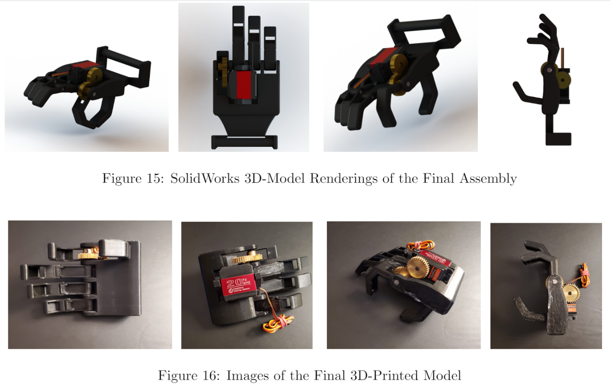

# Intelligent Multimodal Prosthetic Hand
- Designed and developed a prosthetic hand allowing for the detection of object rigidity
- Integrated the prosthetic hand with tactile sensing, machine learning and computer vision

